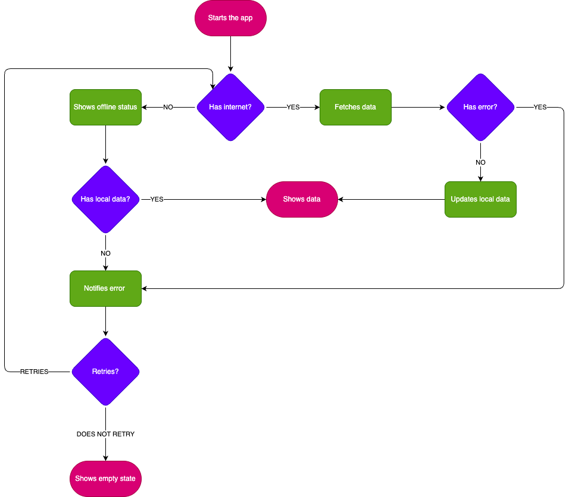

# Photo Album App
This project implements an offline-first, paginated photo album listing feature using modern Android development
best practices. It fetches a list of albums from a remote data source, caches them locally, and displays
them efficiently with local pagination.

### Note
This project hides API secrets by loading them locally via BuildConfig, to simulate a more secure production 
environment. Nonetheless, this is a demo app after all, so, if you wish to run the app locally, add 
to the root of the project a `keys.properties` file with this content:

```
api.host=leehendryp.github.io
api.path=mock-albums/mock_albums.json
api.user.agent=PhotoAlbumApp/1.0
```

## Tech Stack
* Kotlin;
* Coroutines / Flow (async and reactive programming);
* MVI (unidirectional data flow);
* Compose (UI);
* Material 3;
* Navigation;
* Room (local persistence);
* Paging 3 (pagination);
* Hilt (dependency injection);
* Coil (image loading);
* MockK and Robolectric (unit testing);
* Spotless (code style);
* Detekt (code quality);
* **GitHub Projects** (Kanban board for issue tracking); and
* **GitHub Actions** (for CI workflows).

## Features
* Unidirectional data flow via MVI + Clean Architecture;
* Offline-first pagination via Paging 3 + Room + RemoteMediator;
* State handling (loading, empty, error, content);
* Clean, testable architecture separating data, domain, and presentation layers;
* Feature-package organization (in case of future modularization);
* Network status awareness;
* Declarative empty-state detection in the UI (needed for Paging 3);
* Error handling using sealed exceptions; 
* API secret loading via BuildConfig; and
* Automated tests (mostly unit tests).

## Architecture

### Base Flowchart
The implementation tries to be as true as possible to the initial interaction design elaborated in the
beginning of the project.



### Clean Architecture
The code is organized into distinct layers (data, domain, and presentation) to enforce clear separation
of concerns.

The data layer handles remote data retrieval and local persistence; the domain layer defines
core business logic; and the presentation layer manages UI logic and user interactions.

This approach ensures modularity, testability, and maintainability of the code.

Currently, UI-specific representations of domain models as well as use cases are not used in this app, 
due to Keep It Stupid Simple and You Ain't Gonna Need It principles. As soon as such resources are 
relevant, they will be implemented accordingly.

### Model-View-Intent (MVI)
The app implements an MVI architecture to manage UI states and user interactions in a predictable
unidirectional data flow. This approach ensures a single source of truth for the UI, turning complex
state management into a structured and reliable flow of information.

In summary, the UI dispatches user interactions in the form of Intents to an MVI Presenter, which,
in turn, processes information into either new UI States (such as loading, empty, error, and content)
or UI Side Effects (such as navigation), which are fed back to the UI via data-binding.

This design pattern ensures a clear separation between logic and rendering, improves traceability of
state changes (as it data-binds snapshots of UI states), and makes the app more resilient to configuration
changes and lifecycle events.

Note that, due to Paging 3's highly opinionated API, part of the unidirectional data flow is actually
handled by the library itself. This trade-off js instrumental in achieving the best possible integration 
between Room, Paging, and Compose.

### Offline-first Approach with Room + Paging 3
Although the REST API itself does not paginate items, the app makes use of Room + Paging 3 integration
to provide efficiently-paged content.

* The UI collects paged data using LazyPagingItems;
* Room emits its current PagingSource data;
* RemoteMediator triggers remote data fetch on startup and then persists data to Room; and
* Room emits changes to the PagingSource data.

### Stateless repository pattern
The repository acts as an abstraction between remote and local data sources, providing a single source
of truth for synchronized data.

This project intentionally avoids keeping state in the repository layer to:

* Simply emit a stream of data from its sources;
* Preserve separation of concerns;
* Avoid tightly coupling repository state to the UI lifecycle;
* Delegate state interpretation to observers (such as MVI Presenters); and
* Facilitate testing and debugging.

### Navigation
This project uses Jetpack Compose Navigation with a route interface pattern to define and manage app
destinations, featuring scalable and clean separation of concerns due to:

* Decoupled and composable navigation logic;
* Feature-based navigation graphs; and
* Dynamic routing and argument.

## Tooling & Project Management

### GitHub Projects (Kanban)
This project leverages **GitHub Projects** to track issues and tasks in a Kanban-style board. It ensures 
visibility of ongoing development, bug tracking, and feature planning.

### GitHub Actions (CI)
Automated workflows are powered by **GitHub Actions**, enabling continuous integration for testing and
ensuring code quality across changes and pull requests.

The following jobs are defined:

* Spotless: Runs formatting checks and auto-fixes code style violations using Spotless before code analysis
begins. 
* Detekt: Executes static code analysis using Detekt to catch potential bugs, code smells, and 
maintainability issues. 
* Unit Tests: Runs the test suite against the debug build variant to validate the business logic and
* architectural correctness.

These jobs are triggered on every pull request targeting the develop or main branches to enforce quality
gates before merging.

## Summary
This project demonstrates a clean, scalable pattern for paginated, offline-first data loading in Android,
balancing out Google's recommendations and practical solutions to common Android development caveats.

Feel free to reach out for questions or improvements!
